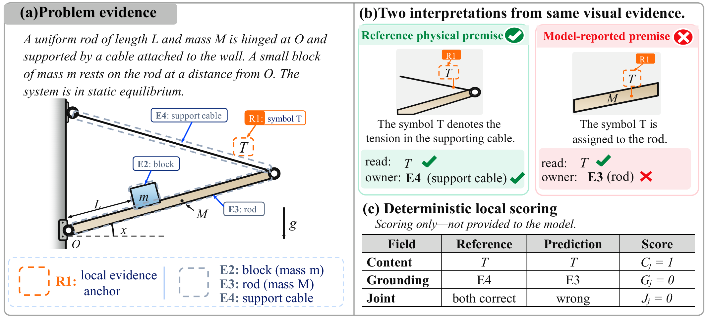
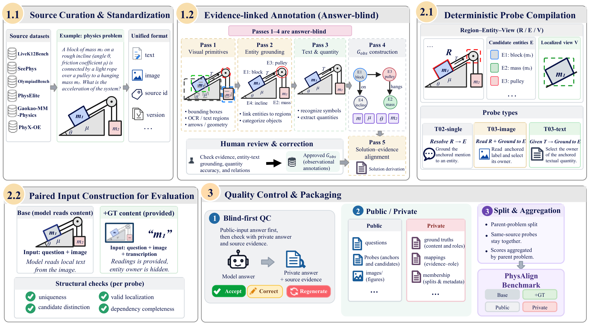

<div align="center">

<h1>PhysAlign</h1>

<h2>PhysAlign: A Benchmark for Evidence-Grounded Role Alignment<br />in Multimodal Physics Reasoning</h2>

<p>
  <a href="https://arxiv.org/abs/XXXX.XXXXX"></a>
  <a href="https://huggingface.co/datasets/Jetson888/PhysAlign"></a>
  <a href="https://physalign-lab.github.io/"></a>
</p>

<p>
  <a href="#overview">Overview</a> ·
  <a href="#leaderboard">Leaderboard</a> ·
  <a href="#quick-start">Quick Start</a> ·
  <a href="#evaluation">Evaluation</a> ·
  <a href="#citation">Citation</a>
</p>

<sub>The arXiv link is an explicit placeholder and will be replaced after upload.</sub>

</div>

## Overview

**Recognizing a symbol is not the same as understanding its physical role.** A model may correctly read a tension symbol **T**, yet associate it with the rod instead of the supporting cable. PhysAlign makes this distinction measurable.

PhysAlign evaluates **evidence-grounded physical-role alignment** using localized probes that retain the original physics problem, diagram, evidence anchor, and candidate entities. Recognition and grounding are scored separately; a matched **Base / +GT** control tests whether providing correct local readings improves role assignment.

<p align="center">
  
  <br />
  <sub><strong>Figure 1.</strong> Correct local recognition can coexist with incorrect physical-role grounding. Original illustration from the manuscript.</sub>
</p>

| Benchmark at a glance | Scope |
| :--- | :--- |
| **3,341** localized probes | **986** parent physics problems from **6** source datasets |
| **3** probe interfaces | Entity reference, image-quantity ownership, and text-quantity ownership |
| **553** eligible +GT variants | Paired inputs from **385** parents; variants do not add unique probes |
| **412** joint-evaluation probes | **311** parents with independent recognition and grounding targets |

The framework covers answer-blind annotation, probe construction and review, frozen evaluation plans, model adapters, deterministic local scoring, and result visualization. The repository's runnable example is **synthetic**; use the [Hugging Face dataset](https://huggingface.co/datasets/Jetson888/PhysAlign) for the benchmark distribution.

## Leaderboard

**Six-model baseline results from Table 2 of the manuscript.** The default ranking uses **GAcc on the full grounding set**, in descending order. These are paper-reported point estimates, not live submissions or a significance ranking.

<!-- PHYSALIGN:MAIN_TABLE:START -->
| Rank | Model | GAcc (G) ↑ | CAcc (L) ↑ | GAcc (L) ↑ | JAcc (L) ↑ | SolveAcc ↑ |
| :---: | :--- | ---: | ---: | ---: | ---: | ---: |
| 1 | Gemini 3.8 Flash | **90.71** | 85.20 | 79.33 | 70.59 | 21.31 |
| 2 | Qwen3.5-27B | 84.11 | 84.14 | 80.29 | 68.12 | 18.39 |
| 3 | GPT-6 Astra | 81.94 | **89.44** | **83.31** | **77.13** | **71.72** |
| 4 | Qwen3.5-9B | 40.52 | 65.81 | 54.55 | 37.55 | 12.12 |
| 5 | Qwen3.5-4B | 40.21 | 53.97 | 46.51 | 32.09 | 9.94 |
| 6 | InternVL3.5-8B | 23.52 | 2.12 | 33.36 | 1.05 | 7.47 |
<!-- PHYSALIGN:MAIN_TABLE:END -->

**Read the columns by their evaluation scope:**

- **GAcc (G):** physical-role grounding over **3,341 probes / 986 parents**.
- **CAcc, GAcc (L), JAcc:** recognition, grounding, and joint correctness on the same **412 probes / 311 parents**. Per probe, joint correctness is `J = C × G`; aggregate JAcc is not the product of aggregate accuracies.
- **SolveAcc:** mean normalized original-problem credit over **986 parents**, including partial credit; it is **not binary answer accuracy**.

All values are percentages; higher is better. The paper evaluates **development and test combined**, not the held-out test split alone. Local metrics use parent-balanced, task-type-weighted aggregation. Bold values mark column maxima.

<details>
<summary><strong>Paired reading control: Base → +GT</strong></summary>

The +GT condition provides verified local readings while withholding the queried physical-role target. Inputs otherwise keep the original problem, anchors, question, candidates, and output schema fixed.

<!-- PHYSALIGN:PAIRED_TABLE:START -->
| Model | Base GAcc ↑ | +GT GAcc ↑ | Δ GAcc (pp) | Parents / probes |
| :--- | ---: | ---: | ---: | ---: |
| Qwen3.5-4B | 46.51 | 54.61 | +8.10 | 311 / 412 |
| Qwen3.5-9B | 54.55 | 56.53 | +1.98 | 311 / 412 |
| Qwen3.5-27B | 80.29 | 82.00 | +1.71 | 311 / 412 |
| InternVL3.5-8B | 33.36 | 34.81 | +1.45 | 311 / 412 |
| GPT-6 Astra | 83.59 | 84.90 | +1.32 | 304 / 397 |
| Gemini 3.8 Flash | 78.67 | 80.86 | +2.20 | 304 / 397 |
<!-- PHYSALIGN:PAIRED_TABLE:END -->

These are model-specific observed paired subsets, **not all 553 eligible variants**. Open-weight models use **412 probes / 311 parents**; API models use **397 probes / 304 parents**. Compare Base and +GT **within each row**. The reported Δ values are independently rounded in the paper and may differ by 0.01 from subtracting displayed values. Positive aggregate changes do not imply improvement on every probe.

</details>

The central finding is a persistent gap between correct recognition and correct grounding: the paper reports approximately **13.8% conditional grounding error for GPT-6 Astra even when local content is recognized correctly**. Supplied readings also do not establish a perfect-perception upper bound.

Baseline data: [JSON](docs/leaderboard/results.json). A sortable, filterable local leaderboard is included in [`docs/leaderboard/`](docs/leaderboard/README.md), ready for adaptation to the project page.

## Benchmark design

<p align="center">
  
  <br />
  <sub><strong>Figure 2.</strong> The original dataset-construction and evaluation pipeline from the manuscript.</sub>
</p>

| Interface | Evidence anchor | Model task |
| :--- | :--- | :--- |
| `T02-single` | An anchored entity mention | Resolve the mention to the corresponding entity |
| `T03-image` | A quantity label in the diagram | Read the label and identify its physical owner |
| `T03-text` | A quantity in the problem text | Identify the quantity's physical owner |

Candidates use neutral aliases tied to evidence. An owner can be an object, force, or field, according to the source annotation. Probes with no independent reading target receive grounding scores only.

**Base → +GT is a controlled input comparison.** +GT may supply “R1 reads T”; it must not supply “T denotes the tension in cable E4,” which would reveal the queried correspondence. The two conditions run in independent contexts.

<details>
<summary><strong>Dataset sources and release partition</strong></summary>

| Source | Parent problems |
| :--- | ---: |
| SeePhys | 268 |
| LiveK12Bench | 250 |
| PhysElite | 220 |
| OlympiadBench — English physics competition subset | 209 |
| Gaokao-MM-Physics | 23 |
| PhyX-OE | 16 |
| **Total** | **986** |

| Release split | Parents | Local probes | Eligible +GT variants |
| :--- | ---: | ---: | ---: |
| Development | 79 | 208 | 90 |
| Test | 907 | 3,133 | 463 |
| **Full release** | **986** | **3,341** | **553** |

Parent problems do not cross the release split. The manuscript's baseline evaluation pools use both partitions together; the leaderboard above must not be relabeled as test-only performance. Counts are from Table 1.

</details>

## Quick start

Use **Python 3.11+** for a common environment across the evaluation framework and annotation pipeline. Run commands from the repository root.

### Run the synthetic evaluation example

The core evaluator uses the Python standard library. No model download or API key is required for this smoke run.

```bash
python evaluate.py prepare --dataset examples/synthetic --split framework_development --bootstrap-resamples 0 --plan plans/example.json
python evaluate.py run --plan plans/example.json --output runs/example-smoke --adapter smoke
python evaluate.py score --run runs/example-smoke
```

The bundled example contains **3 synthetic parent problems, 6 probes, and 9 requests**. The `smoke` adapter returns fixed outputs and reports `scientific_run=false`; these outputs are for checking the workflow and do not reproduce the paper's scores. Plan and output paths must be new; use `--resume` only to continue the corresponding run.

### Prepare an annotation workspace

```bash
python -m pip install -e ./PhysAlign_data_build
python -m physgraph_pipeline doctor --config PhysAlign_data_build/configs/datasets/minimal_physics.json
python -m physgraph_pipeline prepare --config PhysAlign_data_build/configs/datasets/minimal_physics.json
python -m physgraph_pipeline serve --config PhysAlign_data_build/configs/datasets/minimal_physics.json --open-browser
```

This creates a local workspace from an original synthetic diagram. API-assisted annotation is optional and requires the `api` extra plus your own endpoint credentials. See the [annotation pipeline](PhysAlign_data_build/README.md).

## Evaluation

For real runs, use an audited benchmark package and a configured model adapter. The evaluation flow freezes identities, candidate order, model settings, populations, weights, and hashes before inference, then scores outputs independently.

1. **Construct and review:** answer-blind Passes 1–4 supply observational targets. Pass 5 is for solution alignment and analysis, not probe truth.
2. **Compile and freeze:** Benchmark Kit builds localized probes, separates public inputs from scoring targets, and records review evidence.
3. **Run and score:** use independent Base/+GT requests, deterministic local metrics, and uncertainty estimates with the declared parent or source-cluster sampling unit.

The code retains the terms **Raw / Gold** for **Base / +GT** and **BAcc** for the paper's grounding metric **GAcc**. Always match the population and weights before comparing numbers; a full-set Base score is not interchangeable with a paired-subset Base score.

| Task | Documentation |
| :--- | :--- |
| Evaluation, scoring, populations, and adapters | [Evaluation guide](docs/EVALUATION.md) |
| API-based model evaluation | [API models](docs/API_MODELS.md) |
| Local model and server setup | [Server setup](docs/SERVER_SETUP.md) |
| Probe compilation and benchmark review | [Benchmark Kit](PhysAlign_Benchmark_Kit/README.md) |
| Annotation and dataset construction | [Data-build pipeline](PhysAlign_data_build/README.md) |
| Figures and result visualization | [Visualization guide](docs/FIGURES.md) |
| Complete directory map and checks | [Project layout](docs/PROJECT_LAYOUT.md) |

## Repository structure

```text
PhysAlign/
├── PhysAlign_data_build/       # Annotation, source adapters, and local review
├── PhysAlign_Benchmark_Kit/    # Probe construction, QA, and benchmark packaging
├── physalign/                 # Frozen plans, inference orchestration, and scoring
├── server_eval/               # Model adapters and additional evaluation workflows
├── physalign_viz/              # Figures, tables, and offline result galleries
├── configs/                   # Portable configuration examples
├── examples/synthetic/        # Small synthetic evaluation package
├── docs/leaderboard/           # Paper baseline data and interactive local preview
├── evaluate.py                # Evaluation CLI
└── plot_results.py            # Visualization CLI
```

## Citation

This **provisional citation** will be updated with author information and the arXiv identifier when the preprint is available.

```bibtex
@misc{physalign2026,
  title = {{PhysAlign}: A Benchmark for Evidence-Grounded Role Alignment in Multimodal Physics Reasoning},
  year  = {2026},
  url   = {https://physalign-lab.github.io/},
  note  = {Preprint forthcoming; bibliographic metadata to be updated}
}
```

## License and data use

A repository-wide license has not yet been designated. The annotation pipeline carries its own [MIT license](PhysAlign_data_build/LICENSE); this does not assign the same license to the rest of the repository or to source datasets. Refer to the benchmark distribution and the original source datasets for their respective data-use terms.
